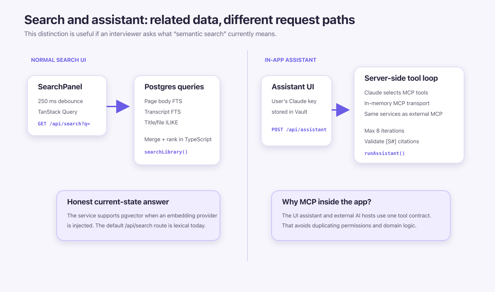

# Lumen demo guide

Use this as a study sheet, not a speech to memorize word-for-word.

## 60-second explanation

> Lumen is a study workspace for multiple users. Each user can organise notes,
> PDFs, recordings, transcripts, and tags without seeing anybody else's data.
> Next.js and React power the web app. Supabase handles login, the Postgres
> database, private file storage, and database-level access rules. Slow
> transcription runs in a separate pg-boss worker so it does not hold up the
> website. Live transcription runs inside the user's browser.
>
> The application's rules live in a service layer rather than inside pages or
> API routes. This lets the website, assistant, and MCP tools reuse the same
> code. Normal requests are restricted by Row-Level Security, or RLS. The
> background worker has a secret connection that can bypass RLS, so its queries
> must always filter by the job's trusted `userId`.


## Demo plan

Aim for 20 minutes. Stop after each section and ask if the interviewer wants
more detail.

### 1. Log in and explain auth


1. Log in with the local seed user: `demo@lumen.test` / `demo12345`.
2. Explain that the form calls server-side code called a React server action.
3. Supabase checks the password and stores the login session in a secure cookie.
4. Next.js `proxy.ts` refreshes the session and redirects unauthenticated users.
5. The protected page checks `getUser()` again before showing private data.
6. Database queries still pass through RLS, which only exposes the user's rows.

What I would say:

> The redirect is not my only security check. The page verifies the user again,
> and the database has the final access rule. This layered approach is called
> defense in depth.

Code: [`auth/actions.ts`](../apps/web/src/server/auth/actions.ts),
[`proxy.ts`](../apps/web/src/proxy.ts),
[`db/client.ts`](../apps/web/src/server/db/client.ts), and
[`SECURITY.md`](SECURITY.md).

#### Why Next.js, TypeScript, and Supabase for auth?

- Next.js keeps the React screens and their server-side actions in one project.
- TypeScript catches many incorrect data shapes before the app runs.
- Supabase Auth works with the same database and RLS rules used by the rest of
  the app, so there is one identity system to understand.
- The trade-off is learning which Next.js code runs in the browser and which
  runs on the server. Depending on Supabase also creates some platform lock-in.

### 2. Show the library


1. Open the seeded **Course notes** workspace.
2. Point out the single `library_nodes` tree.
3. Create a workspace, folder, and note.
4. Select several rows and show Move, Tags, and Delete.
5. Resize to mobile if there is time; the sidebar becomes a drawer.


What I would say:

> Workspaces, pages, PDFs, and audio are all items in one tree. Each item points
> to its parent, like a file system. This is easier to reason about than building
> separate navigation systems for every file type.

TanStack Query loads one snapshot of the library and caches it in the browser.
After a create, move, tag, or delete action, the app asks for a fresh snapshot.
The API route checks the request and passes it to the service layer, where the
actual library rules live.

Code: [`library-workspace.tsx`](../apps/web/src/components/library/library-workspace.tsx),
[`library route`](../apps/web/src/app/api/library/route.ts), and
[`library-nodes.ts`](../apps/web/src/server/services/library-nodes.ts).

#### Why one tree, TanStack Query, and a service layer?

- One tree gives every library item the same rules for nesting, moving, tagging,
  and deleting.
- TanStack Query handles loading, caching, and refreshing server data instead
  of building that state management by hand.
- The service layer keeps business rules separate from Next.js. The UI,
  assistant, and future clients can call the same logic.
- The trade-off is an extra layer of code and a browser cache that must be
  refreshed after changes.

### 3. Edit a note


1. Open a note.
2. Type a short sentence and show the save status.
3. Wait for **Saved** before leaving.
4. Show a task list, link, or table if asked about rich text.

What the note taker uses:

- TipTap 3 on top of ProseMirror.
- StarterKit, links, placeholders, tables, task lists, and task items.
- A browser-side React component because the editor needs keyboard and selection
  state.
- `immediatelyRender: false` so the browser and server do not produce different
  initial HTML.
- An 800 ms autosave delay.
- TipTap JSON stored in `content_json`.
- Plain text derived on the server and stored in `content_text` for search.

What I would say:

> I store the structured TipTap document so formatting, tables, and task lists
> are preserved. The server also produces a plain-text copy for search. Creating
> that copy on the server keeps it consistent with the saved note.

Code: [`document-editor.tsx`](../apps/web/src/components/editor/document-editor.tsx)
and [`editor-content.ts`](../apps/web/src/server/services/editor-content.ts).

#### Why TipTap?

- TipTap provides a ready-made rich-text editor while still allowing custom
  menus and extensions.
- Its JSON format preserves document structure better than saving raw HTML or
  plain text alone.
- It is built on ProseMirror, a mature editing foundation.
- The trade-off is more browser code and extra care when Next.js first renders
  the page.

### 4. Upload and transcribe audio

Before the interview, use a short, clear 10–20 second audio file and start the
worker. The first model load can be slow, so pre-download it.

1. Upload the audio inside a workspace.
2. Point out the `pending` recording state.
3. Show the worker terminal changing it to `processing`.
4. Open the recording after it becomes `done`.
5. Click a transcript segment to seek the audio player.
6. If it fails, show the `failed` state and explain retry instead of debugging
   live during the interview.


The screenshot below is a real local failed job captured before CMake and
FFmpeg were installed. It shows that the app records the error and offers a
Retry action. The required build tools and `whisper-cli` are now installed
locally.


Important details:

- The authenticated upload route accepts only PDF or `audio/*`.
- Bytes go to the private `library-files` Supabase bucket.
- The route creates an audio node and a `pending` recording.
- The pg-boss payload contains `userId`, `recordingId`, `nodeId`, and
  `storageKey`.
- The worker downloads to a temporary path, optionally detects speaker changes,
  runs `nodejs-whisper`, writes transcript segments, and deletes the temp file.
- Speaker detection (diarization) uses sherpa-onnx. If it fails, speaker names
  stay blank but the transcript can still succeed.
- A job is retried up to three times with backoff.

Code: [`uploads.ts`](../apps/web/src/server/services/uploads.ts),
[`transcription-jobs.ts`](../apps/web/src/server/queue/transcription-jobs.ts),
[`transcription-worker.ts`](../apps/web/worker/transcription-worker.ts), and
[`audio-convert.ts`](../apps/web/worker/audio-convert.ts).

#### Why pg-boss, Whisper, CMake, and FFmpeg?

- Transcription takes too long for a normal web request. pg-boss saves the job
  in Postgres so a separate worker can process it, retry it, and survive an app
  restart.
- pg-boss reuses the existing Postgres database. Redis would be another service
  to deploy and monitor.
- Whisper performs speech recognition locally in the worker rather than sending
  recordings to a transcription API.
- CMake builds Whisper's native C++ program, `whisper-cli`. It is a setup/build
  tool and does not run for every transcript.
- FFmpeg reads different audio formats and converts them into predictable audio
  for Whisper or speaker detection.
- Provider interfaces let tests replace real storage and transcription with
  simple fakes.
- The trade-off is more work for the worker machine: native build tools, model
  files, CPU time, and a long-lived database connection are required.

### 5. Explain live transcription

Run this only if the browser model is already cached and microphone permissions
are tested. It is a useful backup explanation even if it is not part of the
live demo.


What I would say:

> Live transcription uses a separate browser-based provider. The browser saves
> the microphone recording while also sending small audio windows to a Web
> Worker. Transformers.js Whisper transcribes those windows without freezing
> the page. Finished text is saved to Postgres during the session. When the user
> stops, the complete WebM recording is uploaded.

Optional speaker labels happen later through a `label-speakers` pg-boss job.
A scheduled job runs every 15 minutes to find abandoned live sessions. It saves
sessions that contain text and marks empty ones failed.

Code: [`asr-worker.ts`](../apps/web/src/lib/transcription/asr-worker.ts),
[`live-session-capture.tsx`](../apps/web/src/components/transcripts/live-session-capture.tsx),
and [`live-sessions.ts`](../apps/web/src/server/services/live-sessions.ts).

#### Why a browser Web Worker and Transformers.js?

- The user sees text while speaking instead of waiting for a batch job.
- A Web Worker performs the heavy work away from the main browser thread, which
  helps keep buttons and typing responsive.
- Transformers.js can use WebGPU when available and fall back to WebAssembly
  when it is not.
- The trade-off is a large model download and performance that varies between
  devices. That is why batch transcription remains the safer default.

### 6. Search and assistant

1. Search for `mitochondria` and open the seeded note.
2. Explain that the search waits 250 ms after typing before making a request,
   which avoids sending a request after every keystroke.
3. If a Claude key is configured, ask the assistant a question and open a
   citation.
4. Show the tool trace if the assistant calls `search_notes` or
   `get_transcript`.




What I would say:

> The normal search box asks Postgres to find matching words in note and
> transcript text. Titles use a simpler partial-text match. The service also has
> support for meaning-based vector search, but the normal search screen does not
> turn it on yet.
>
> The assistant uses the user's Claude key and can call a limited set of Lumen
> tools. Those tools come from the same MCP server available to external
> clients. Lumen checks each `[S#]` citation before turning it into a link.

The Claude key is stored per user in Supabase Vault. It is decrypted only on
the server when a request runs.

Code: [`search.ts`](../apps/web/src/server/services/search.ts),
[`assistant.ts`](../apps/web/src/server/services/assistant.ts), and
[`MCP tools`](../apps/web/src/server/mcp/tools.ts).

#### Why Postgres search, pgvector, and MCP?

- Postgres already stores the content, so its built-in text search is a simple
  and dependable starting point.
- pgvector adds meaning-based search without introducing a separate vector
  database.
- MCP gives the assistant and external clients one standard set of tools instead
  of creating a second copy of the application's business logic.
- The trade-off is that normal search is still mainly word matching. Claude is
  also a cloud service, so selected context leaves Lumen when the assistant is
  used.

One Next.js 16 detail to remember: older tutorials use `middleware.ts`; this
application uses the renamed `proxy.ts` convention.

## Honest limitations

Do not overclaim these points:

- **Batch transcription is not always on the user's computer.** It uses a local
  Whisper model rather than a transcription API, but production runs the
  worker on Railway and stores audio in Supabase.
- **Live inference is on-device, but saved audio leaves the browser.** The final
  WebM is uploaded to private Supabase Storage.
- **The normal search box is lexical today.** pgvector and embedding seams
  exist, but `/api/search` does not enable them by default.
- **The assistant is cloud inference.** Prompts and selected workspace context
  go to Anthropic using the user's Claude key.
- **Diarization can be wrong.** It is optional and deliberately cannot make a
  successful transcript fail.
- **Realtime collaboration is not built.**
- **The worker is the dangerous data path.** Its secret role bypasses RLS.

Saying “I would need to check the code” is better than guessing.

## Local setup before the demo

Prerequisites: Bun 1.3.14, Docker Desktop or Podman, CMake, FFmpeg, and
Chromium for Playwright. CMake is required when `nodejs-whisper` builds its
local whisper.cpp binary.

```bash
bun install --frozen-lockfile
bunx playwright install chromium

cd apps/web
bunx supabase start
bunx supabase db reset
bunx supabase status
```

Create `apps/web/.env.local` from `.env.example`. Map values from
`supabase status -o env`:

- `API_URL` → `NEXT_PUBLIC_SUPABASE_URL`
- `ANON_KEY` → `NEXT_PUBLIC_SUPABASE_PUBLISHABLE_KEY`
- `SERVICE_ROLE_KEY` → `SUPABASE_SECRET_KEY`
- `DB_URL` → `PG_BOSS_DATABASE_URL`

Keep `DIARIZATION_ENABLED=false` for the safest interview demo.

```bash
# Terminal 1
cd apps/web
bun run worker:download-model
bun run dev

# Terminal 2
cd apps/web
bun run worker:transcribe
```

Open `http://localhost:3000`. Resetting the local database recreates the demo
user and seeded biology note.

## Test commands

```bash
# Fast, database-free quality gate
bun run check

# Supabase-backed desktop + mobile browser flows
bun run test:e2e
```

`bun run test:e2e` validates the environment, starts/reuses the Next dev server,
and runs Playwright. The normal suite logs in, creates and cleans up library
data, searches the seeded note, and checks the mobile drawer/tag flows.

The live recording test is skipped by default because it needs a fake microphone
WAV and downloads a browser Whisper model:

```bash
cd apps/web
LIVE_SESSION_E2E=1 \
LIVE_SESSION_WAV=/absolute/path/to/clear-speech.wav \
bun run test:e2e e2e/live-session.spec.ts
```

### Why Bun, Turbo, Biome, Vitest, and Playwright?

- Bun installs packages and runs the TypeScript workspace scripts quickly.
- Turbo coordinates checks across the web app, marketing app, and shared UI
  package.
- Biome checks formatting and common code mistakes.
- Vitest checks small pieces of logic and React components without opening a
  full browser.
- Playwright checks real user flows in Chromium, including desktop and mobile
  layouts.
- The trade-off is that the browser tests need Chromium and a running local
  Supabase stack.

## Pre-demo checklist

- [ ] Run `bun run check`.
- [ ] Run `bun run test:e2e`.
- [ ] Reset Supabase and confirm the seed login.
- [ ] Confirm `cmake --version` and `ffmpeg -version` work.
- [ ] Pre-download the batch Whisper model.
- [ ] Start the web app and worker in separate terminals.
- [ ] Upload the exact audio file you will use.
- [ ] Confirm transcript status reaches `done`.
- [ ] Confirm search opens the seeded note.
- [ ] Use a desktop width if showing the assistant.
- [ ] Keep the flow images open as a fallback.
- [ ] Do not reset the database during the interview.

If batch transcription is slow, continue with notes/search and return to the
recording later. The queue is asynchronous by design, so this is a valid
architecture demonstration.
