# Lumen demo walkthrough

Use this as a click-by-click interview prompt. It is not a speech to memorise.

## Before you start

- Aim for about 20 minutes.
- This walkthrough assumes the production app and the `young142001+nongoogle@gmail.com` account.
- Keep the demo inside the Lumen browser window. The app's visible status, saving, and error states should carry the story without opening hosting or database dashboards.
- Keep the explanation focused on what the user can see.
- Use the **What to do** bullets to drive the demo.
- Use the **What to say** bullets as short talking points.
- If somebody asks for a deeper detail, open the linked package docs or code.
- It is completely fine to say, “I would need to check the docs or code rather than guess.”

## 60-second introduction

- Lumen is a study workspace for notes, PDFs, recordings, transcripts, and tags.
- I built the web app with Next.js, React, and TypeScript.
- Supabase handles sign-in, the database, and private file storage.
- Longer transcription work runs separately so the website does not have to sit and wait for it.
- Live transcription can run in the browser while the user is speaking.
- The main goal was to make a useful study workflow first, with each user's content kept separate.

Useful reading: [Next.js App Router](https://nextjs.org/docs/app), [React](https://react.dev/learn), [TypeScript](https://www.typescriptlang.org/docs/), and [Supabase](https://supabase.com/docs).

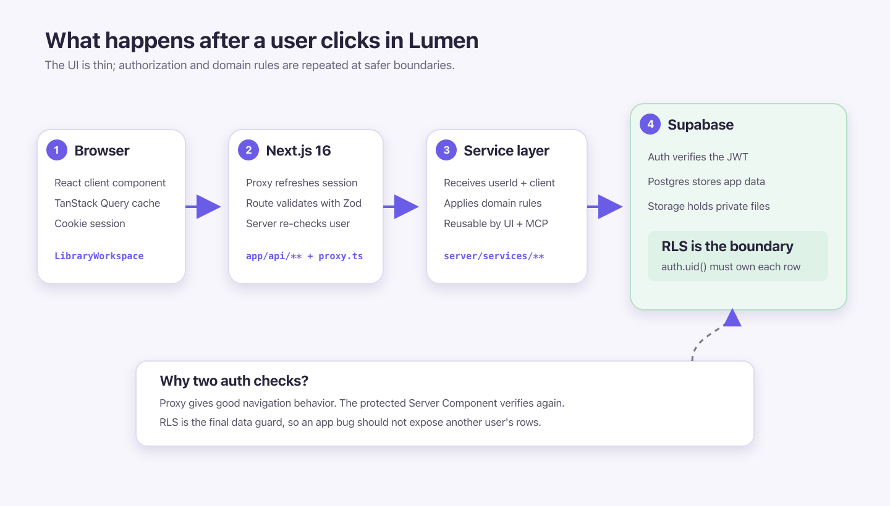

## Walkthrough

### 1. Log in

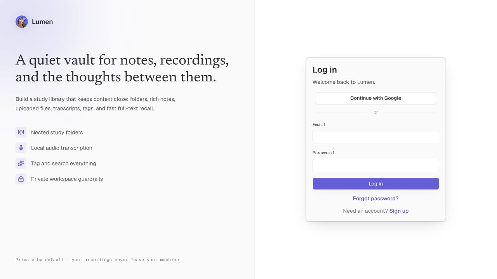

#### What to do

- Open the login page.
- Sign in as `young142001+nongoogle@gmail.com`.
- Show that a successful login opens the private library.
- If useful, open a private URL in a signed-out browser and show that Lumen returns to the login screen.

#### What to say

- “Supabase handles sign-in for me.”
- “If someone is not signed in, Lumen sends them back to the login page.”
- “The database also has rules that keep each user's rows separate.”
- “That means the redirect is not the only thing protecting the data.”

#### What “database rules” means

- Each user-owned domain row carries a `user_id` (the profile row uses the auth user ID as its own primary key). PostgreSQL Row Level Security policies compare that ownership value with the authenticated user's ID, exposed by Supabase as `auth.uid()`.
- Those policies apply when reading, creating, changing, or deleting rows. A normal signed-in request can operate on its own user's rows, but rows belonging to another user are filtered out or rejected by the database.
- The login redirect is useful UX, but it is not the security boundary. RLS still protects the data if somebody calls an API route directly or an application-layer check is missed.
- The background worker is the deliberate exception because its service-role credentials bypass RLS. Every worker path therefore has to establish ownership from `user_id` and scope its reads and writes to that owner; child tables without their own `user_id` are reached only through an already-owned parent.

#### Keep this explanation simple

- Do not volunteer details about cookies, tokens, or session refresh.
- Those are implementation details handled by Supabase and its Next.js helper.
- If asked, say the app follows the Supabase server-side auth guidance and show the official docs or the auth code.
- Next.js 16 calls its request-time route guard `proxy.ts`. Older tutorials may call the same convention middleware.

#### Why Supabase?

- I had already used Supabase in several personal projects and was comfortable with its workflow.
- I like having authentication, a Postgres database, and private file storage in one platform rather than integrating and operating three separate services.
- Supabase Auth saved me from building login and account management from scratch, while its Postgres foundation let me enforce user isolation with database-level RLS policies.
- The trade-off is greater dependence on one platform, but for Lumen the reduced integration work and my existing familiarity made that worthwhile.

#### Why Next.js and TypeScript?

- **Next.js** keeps the screens and the small amount of server-side web code in one project.
- **TypeScript** catches many mismatched data shapes while I am developing.
- The main Next.js trade-off is learning which code runs in the browser and which runs on the server.

Useful reading: [Supabase Auth](https://supabase.com/docs/guides/auth), [Supabase Row Level Security](https://supabase.com/docs/guides/database/postgres/row-level-security), and [Next.js Proxy](https://nextjs.org/docs/app/getting-started/proxy).

If asked to show code: [auth/actions.ts](../apps/web/src/server/auth/actions.ts), [proxy.ts](../apps/web/src/proxy.ts), and [SECURITY.md](SECURITY.md).

### 2. Walk through the library

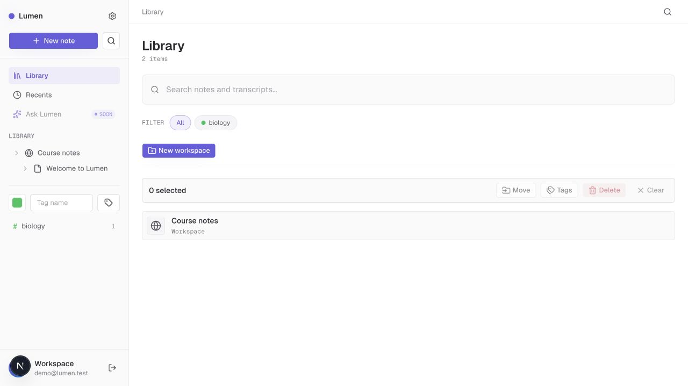

#### What to do

- Open one of the account's populated workspaces and briefly point out its existing folders, files, and PDFs.
- Return to the library and create a disposable workspace named **Demo scratch**.
- Open it and create a folder and a note.
- Select several rows.
- Show **Move**, **Tags**, **Delete**, and **Clear**.
- Only confirm destructive actions against content created in **Demo scratch**.
- Show that clicking the check on a selected row clears the selection.
- If there is time, resize to mobile and open the sidebar drawer.

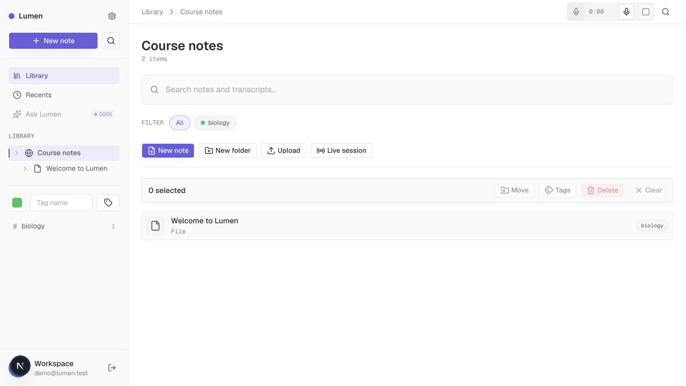

#### What to say

- “The library behaves like a small file system.”
- “A workspace can contain folders, notes, PDFs, and audio.”
- “Under the surface, they use the same basic parent-and-child structure, so I did not need a different navigation system for every file type.”
- “The screen keeps a recent copy of the library data so common changes feel immediate.”
- “Tag creation and assignment update that copy directly instead of reloading the entire library.”

#### Why TanStack Query?

- I did not run a formal comparison of every server-state library. TanStack Query was recommended by the coding agents during planning, and after reading its model I chose it because it matched the problem Lumen had.
- The library data comes from the server and needs loading states, caching, refetching, mutation handling, and a consistent way to decide when data is stale. TanStack Query provides those mechanics instead of making me assemble them from `useEffect`, `useState`, and custom request code.
- Query keys give each server-backed view a stable cache identity. After a mutation, Lumen can update the relevant cached snapshot directly or invalidate its key and refetch.
- This is separate from ordinary local UI state such as which rows are selected or whether a dialog is open; React state still handles those concerns.
- The trade-off is that every mutation must keep the browser's cached copy consistent with the server.

#### Why one library tree?

- Lumen originally modeled folders, documents, uploaded files, and recordings as separate concepts. The navigation-node-tree milestone replaced those parallel navigation models with one `library_nodes` table so every visible library item could share navigation, move, tag, selection, and delete behavior.
- Each node stores one nullable `parent_id`: a workspace has no parent, while every item inside it has exactly one immediate parent. That makes the structure a tree with one canonical location for every item, rather than a graph where an item can appear under several parents.
- A single parent makes common operations predictable: list children by `parent_id`, build breadcrumbs by walking one parent chain, move an item by changing one foreign key, prevent moves into descendants, and cascade deletion down one unambiguous subtree.
- An array of parent IDs would allow multiple paths to the same item. Breadcrumbs, moves, deletion, ordering, and cycle prevention would then need rules for which parent is canonical, and the database would have a harder time enforcing referential integrity for every array element.
- The decision was recorded in the [navigation node tree design](superpowers/specs/2026-06-18-navigation-node-tree-design.md) and implemented in the [navigation node tree milestone](exec-plans/completed/cross-cutting/navigation-node-tree.md).

Useful reading: [TanStack Query overview](https://tanstack.com/query/latest/docs/framework/react/overview) and [query keys](https://tanstack.com/query/latest/docs/framework/react/guides/query-keys).

If asked to show code: [library-workspace.tsx](../apps/web/src/components/library/library-workspace.tsx), [library route](../apps/web/src/app/api/library/route.ts), and [library-nodes.ts](../apps/web/src/server/services/library-nodes.ts).

### 3. Edit a note

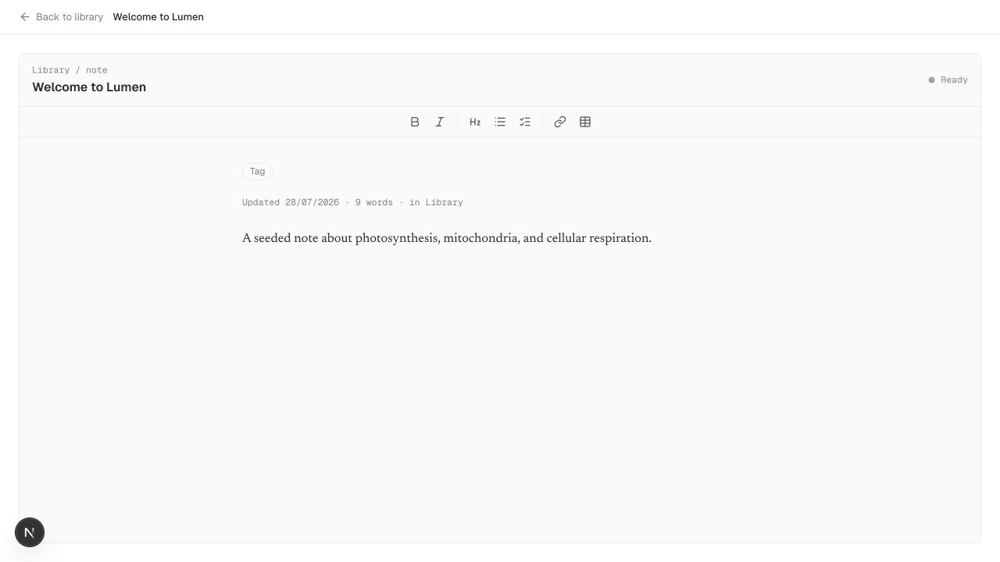

#### What to do

- Open a note.
- Type a short sentence.
- Add a task list, link, or table if there is time.
- Point out the saving message.
- Wait for **Saved** before leaving.

#### What to say

- “TipTap gave me a rich-text editor that I could style for Lumen.”
- “The note keeps its formatting, but I also keep a plain-text version for search.”
- “Saving is automatic, and the status tells the user when it is safe to move on.”

#### Why TipTap?

- I considered [Lexical](https://lexical.dev/) as well. My research and the general community guidance I found leaned toward TipTap for this kind of full note editor, but the deciding factor was practical: TipTap offered a faster path to the feature set Lumen needed.
- TipTap's `StarterKit` and extension ecosystem supplied headings, bold and italic text, lists, undo/redo history, placeholders, links, tables, and task lists without requiring me to design the editor model for each feature.
- Lexical is intentionally lean and modular. Its own documentation says it does not directly concern itself with UI components, toolbars, rich-text features, or Markdown; those capabilities are assembled through plugins. That flexibility is useful, but it meant more editor infrastructure than I wanted to build for this milestone.
- TipTap is still headless: it supplied the editing behavior and structured document model, while I built Lumen's toolbar, styling, autosave status, and persistence around it.
- It stores structured JSON rather than one HTML or plain-text string. The server also derives a plain-text version from that JSON for search.
- The trade-off is a larger, more involved browser component and dependence on TipTap's ProseMirror-based document model.

Useful reading: [TipTap getting started](https://tiptap.dev/docs/editor/getting-started/overview), [TipTap content](https://tiptap.dev/docs/editor/core-concepts/persistence), [TipTap extensions](https://tiptap.dev/docs/editor/extensions/overview), and [Lexical](https://lexical.dev/).

If asked to show code: [document-editor.tsx](../apps/web/src/components/editor/document-editor.tsx) and [editor-content.ts](../apps/web/src/server/services/editor-content.ts).

### 4. Open a PDF

#### What to do

- Open the prepared PDF chosen during the rehearsal. If showing upload is important, upload the rehearsal PDF into **Demo scratch** first.
- Double-click the PDF row.
- Show that it opens without leaving the library.
- Show thumbnails, page navigation, zoom, rotation, search, and download.
- Close it and return to the workspace.

#### What to say

- “PDFs are stored with the other private library files.”
- “The viewer only loads when somebody opens a PDF, so the normal library page does not load all of that PDF code up front.”

#### Why Extend UI?

- [Extend UI](https://www.extend.ai/ui) is an open-source set of React components for document apps.
- I found it online and thought it would be fun to try instead of building a PDF viewer from scratch.
- It gave me a strong starting point that I could adapt to Lumen's design and file flow.
- The trade-off is adding a substantial PDF package to the browser, which is why the viewer loads only when needed.

Useful reading: [Extend UI](https://www.extend.ai/ui), [Supabase Storage](https://supabase.com/docs/guides/storage), and [Next.js lazy loading](https://nextjs.org/docs/app/guides/lazy-loading).

If asked to show code: [pdf-viewer-dialog.tsx](../apps/web/src/components/library/pdf-viewer-dialog.tsx), [pdf-viewer.tsx](../apps/web/src/components/extend-ui/pdf-viewer.tsx), and [uploads.ts](../apps/web/src/server/services/uploads.ts).

### 5. Upload and transcribe audio

#### Before the demo

- Use a clear 10–20 second audio file.
- Rehearse the exact file in production and confirm its status reaches **done**.
- Keep that completed recording and transcript available as a fallback.
- Keep the failed-job screenshot available as a backup.

#### What to do

- Upload the audio inside a workspace.
- Point out the **pending** status.
- Point out the **processing** status.
- Continue to another part of the demo while it runs.
- Return when the status becomes **done**.
- Open the transcript.
- Click a transcript segment and show the audio player jump to that moment.
- If the job fails or takes longer than the rehearsed time, briefly show the visible state, then open the prepared completed transcript instead of debugging live.

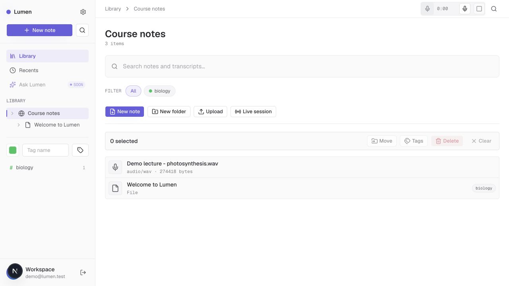

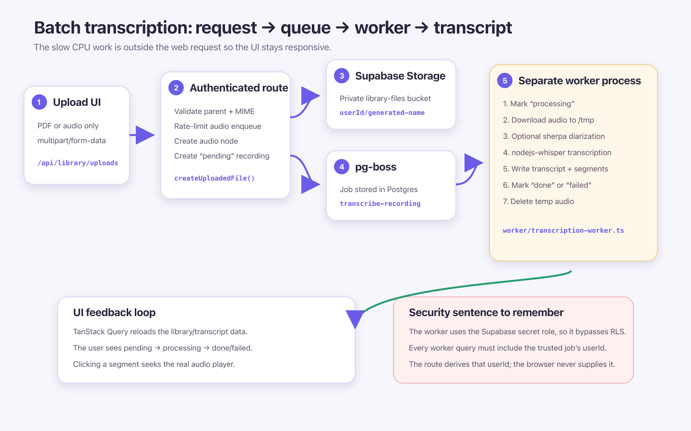

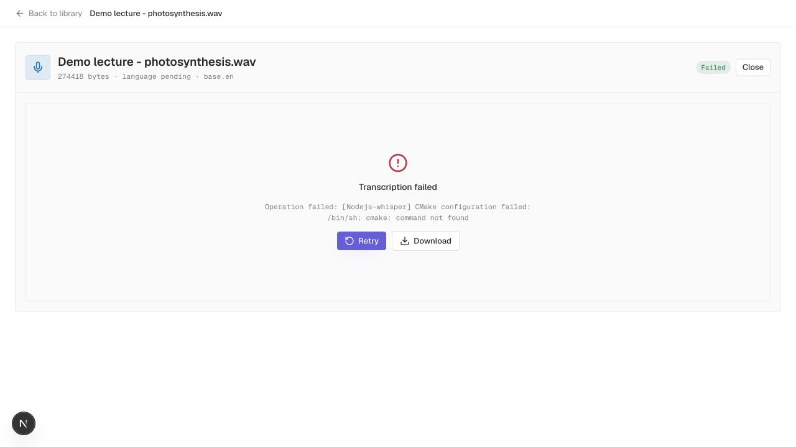

#### What to say

- “The audio is uploaded to private Supabase Storage.”
- “Speech-to-text can take a while, so the app creates a background job instead of making the website wait.”
- “A separate worker picks up that job and runs Whisper.”
- “The visible states—pending, processing, done, or failed—tell the user what is happening.”
- “Speaker labels are optional. If that part fails, the transcript can still succeed.”

#### Why pg-boss and Whisper?

- **pg-boss** stores background jobs in Postgres, which the project already uses.
- That avoided adding another queue service just for this project.
- **Node.js** is a runtime for executing JavaScript outside a web browser, including long-running server and worker processes. Lumen normally starts this TypeScript worker with Bun, whose Node.js compatibility lets it use packages from the Node ecosystem; the worker is also kept Node-compatible as a fallback.
- **Whisper** is an automatic speech-recognition model originally released by OpenAI. It takes spoken audio and produces text with timestamps. Lumen downloads the model files and runs them in its own worker rather than calling a hosted transcription API.
- **whisper.cpp** is a native C/C++ implementation of Whisper that can run the model locally on a CPU.
- **nodejs-whisper** is the adapter between Lumen's TypeScript worker and `whisper.cpp`. It invokes the native program and produces JSON output that Lumen normalizes into full transcript text and timestamped segments.
- **FFmpeg** helps the worker deal with different audio formats.
- **CMake** is part of building the native Whisper program during setup.
- The trade-off is that the worker needs more setup, model files, CPU time, and a long-running process.

Useful reading: [pg-boss](https://github.com/timgit/pg-boss), [nodejs-whisper](https://github.com/ChetanXpro/nodejs-whisper), [FFmpeg](https://ffmpeg.org/documentation.html), [CMake](https://cmake.org/documentation/), and [sherpa-onnx](https://github.com/k2-fsa/sherpa-onnx).

If asked to show code: [uploads.ts](../apps/web/src/server/services/uploads.ts), [transcription-jobs.ts](../apps/web/src/server/queue/transcription-jobs.ts), and [transcription-worker.ts](../apps/web/worker/transcription-worker.ts).

### 6. Optionally show live transcription

Only run this if the browser model is already cached for the production origin and microphone permission has been tested on the demo device and browser.

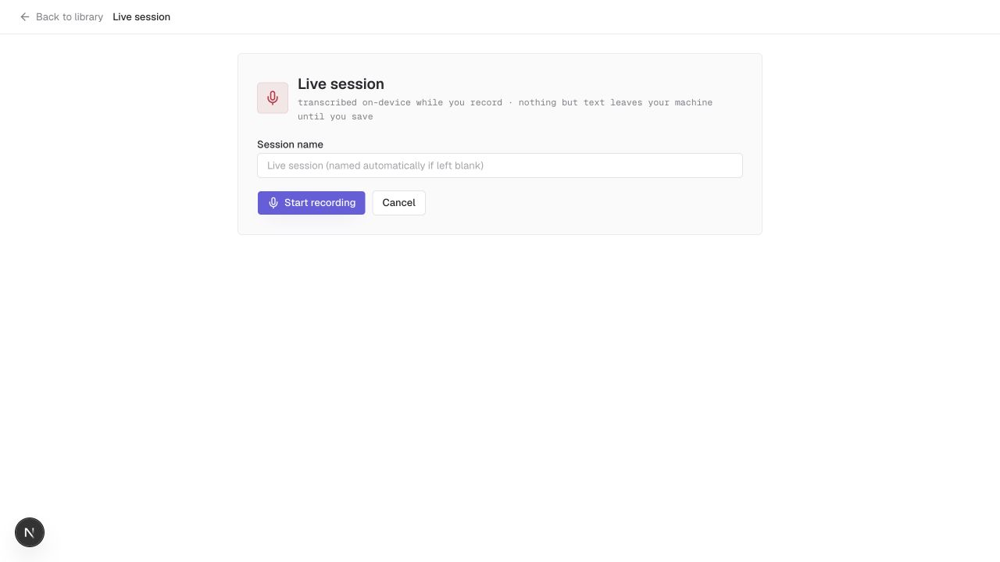

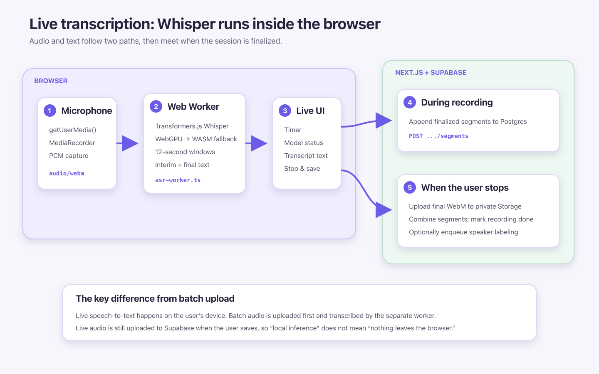

#### What to do

- Open a workspace.
- Select **Live session**.
- Give the session a name.
- Select **Start recording**.
- Say one or two clear sentences.
- Point out the text appearing while you speak.
- Select **Stop & save**.
- Show the saved transcript.

#### What to say

- “For live transcription, the speech model runs in the browser.”
- “The heavier work runs away from the main screen so buttons and typing can stay responsive.”
- “When the user saves, Lumen keeps the transcript and recording.”
- “This is more sensitive to the device and the first model download, so batch transcription is the safer demo path.”

#### Why Transformers.js and a Web Worker?

- **Transformers.js** can run supported machine-learning models in the browser.
- A **Web Worker** provides a background browser thread for heavier work.
- This lets the user see text while speaking without sending each audio window to a transcription API.
- The trade-off is a large model download and performance that varies by device.

Useful reading: [Transformers.js](https://huggingface.co/docs/transformers.js/index) and [MDN Web Workers](https://developer.mozilla.org/en-US/docs/Web/API/Web_Workers_API/Using_web_workers).

If asked to show code: [asr-worker.ts](../apps/web/src/lib/transcription/asr-worker.ts), [live-session-capture.tsx](../apps/web/src/components/transcripts/live-session-capture.tsx), and `[live-sessions.ts](../apps/web/src/server/services/live-sessions.ts)`.

### 7. Search

#### What to do

- Search for the exact distinctive term confirmed during the production rehearsal.
- Point out the matching note or transcript.
- Open the result.
- Show that Lumen takes the user straight to the matching content.

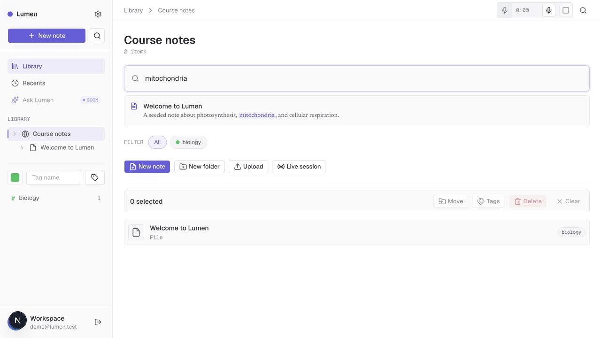

#### What to say

- “The normal search looks for matching words in titles, notes, and transcripts.”
- “The project also has groundwork for meaning-based search, but the search box shown here deliberately uses the simpler word-based path.”

#### Why Postgres search?

- The content already lives in Postgres, so its built-in text search was a practical starting point.
- **pgvector** leaves room for meaning-based search without adding a separate vector database.
- The trade-off is that the current search screen mostly needs the same words the user typed.

Useful reading: [Postgres full-text search](https://www.postgresql.org/docs/current/textsearch.html) and [pgvector](https://github.com/pgvector/pgvector).

If asked to show code: [search.ts](../apps/web/src/server/services/search.ts).

## Close the walkthrough honestly

### Limits I would mention

- **Batch transcription is not always on the user's own computer.** Production runs the worker on Railway and stores audio in Supabase.
- **Live transcription runs locally while recording, but saving uploads the finished recording.**
- **The normal search screen is word-based today.**
- **Speaker labels can be wrong.** They are useful hints, not guaranteed identities.
- **Realtime collaboration is not built.**
- **The worker has powerful database access.** Its jobs must always stay tied to the correct user.

### What I left for later

- **The in-app AI assistant and cited retrieval are built and tested, but their production entry points remain gated.**
- The BYO Claude-key flow still needs its post-launch production verification, so the assistant is intentionally excluded from this walkthrough.
- I kept the library, notes, files, transcription, tagging, and search as the dependable core of the production demo.

## Testing and GitHub Actions

Use this section if the interviewer asks how the project is checked.

### What to show

- If useful, show the green GitHub Actions run for the commit deployed to production.
- Point out that it checks formatting, TypeScript, and the fast test suite.
- Open the GitHub Actions workflow if it is useful.
- Show that the faster quality job runs before the browser tests.
- Explain that failed browser runs keep reports and traces for debugging.

```bash
# Fast, database-free checks
bun run check

# Real browser flows against local Supabase
bun run test:e2e
```

### What to say

- “I use fast tests for most rules and components.”
- “I keep a smaller Playwright suite for the important real-browser flows.”
- “That gives quick feedback without pretending a fake browser can prove that login, routing, and Supabase all work together.”

### Why these testing tools?

- **Vitest** is the fast test runner for TypeScript rules, services, workers, routes, and components.
- **React Testing Library** encourages tests based on what a user can see, click, and read rather than private component details.
- **Playwright** opens a real browser, so it can check login, navigation, network requests, and mobile layouts.
- **React Doctor** adds a separate review for common React, accessibility, performance, and architecture problems.
- **Biome and TypeScript** catch source and type problems before the tests run.
- The trade-off is maintaining several layers. Real browser tests are slower, so they focus on the most valuable journeys.

Useful reading: [Vitest](https://vitest.dev/guide/), [Testing Library principles](https://testing-library.com/docs/guiding-principles/), [Playwright](https://playwright.dev/docs/intro), [GitHub Actions](https://docs.github.com/en/actions), [Biome](https://biomejs.dev/guides/getting-started/), and [React Doctor](https://www.react.doctor/ci).

If asked to show code: [vitest.config.ts](../apps/web/vitest.config.ts), [playwright.config.ts](../apps/web/playwright.config.ts), [library-happy-path.spec.ts](../apps/web/e2e/library-happy-path.spec.ts), [ci.yml](../.github/workflows/ci.yml), and [react-doctor.yml](../.github/workflows/react-doctor.yml).

### What the GitHub pipeline does

- A pull request or push to `main` starts the quality job.
- That job installs the locked dependencies and runs `bun run check`.
- If it passes, the E2E job starts Supabase, installs Chromium, and runs Playwright.
- Failed Playwright runs upload their report and traces for seven days.
- A separate React Doctor workflow reviews changed React files.
- New commits cancel older in-progress runs.

### CI versus deployment

- The GitHub workflow is **continuous integration**: it checks whether a commit is healthy.
- It is not a complete GitHub-controlled deployment pipeline.
- Production runs the app and marketing site on Vercel.
- Production runs the transcription worker on Railway.
- Production setup and smoke testing are documented separately.

Deployment reference: [DEPLOY.md](exec-plans/completed/production/prod-readiness/DEPLOY.md).

## Optional local fallback setup

The production walkthrough does not use these commands. In particular, never run `supabase db reset` or the local seed against the production project.

### One-time requirements

- Bun 1.3.14
- Docker Desktop or Podman
- CMake
- FFmpeg
- Chromium for Playwright

```bash
bun install --frozen-lockfile
bunx playwright install chromium

cd apps/web
bunx supabase start
bunx supabase db reset
bunx supabase status
```

### Local environment

- Create `apps/web/.env.local` from `.env.example`.
- Map the values printed by `supabase status -o env`:
  - `API_URL` → `NEXT_PUBLIC_SUPABASE_URL`
  - `ANON_KEY` → `NEXT_PUBLIC_SUPABASE_PUBLISHABLE_KEY`
  - `SERVICE_ROLE_KEY` → `SUPABASE_SECRET_KEY`
  - `DB_URL` → `PG_BOSS_DATABASE_URL`
- Keep `DIARIZATION_ENABLED=false` for the safest interview demo.

### Start the app

```bash
# Terminal 1
cd apps/web
bun run worker:download-model
bun run dev

# Terminal 2
cd apps/web
bun run worker:transcribe
```

- Open `http://localhost:3000`.
- Resetting the local database recreates the demo user and seeded biology note.

### Optional live-session test

The live recording test is skipped by default because it needs a fake microphone file and downloads a browser Whisper model.

```bash
cd apps/web
LIVE_SESSION_E2E=1 \
LIVE_SESSION_WAV=/absolute/path/to/clear-speech.wav \
bun run test:e2e e2e/live-session.spec.ts
```

## Production pre-demo checklist

Run this against the same production URL, account, browser, device, and network that the interview will use.

### The day before

- [ ] Run `bun run check` and `bun run test:e2e` locally.
- [ ] Confirm the intended commit is deployed and its GitHub Actions checks are
  ```
  green.
  ```
- [ ] Sign in to production as `young142001+nongoogle@gmail.com`.
- [ ] Choose the populated workspace you will open first and confirm its
  ```
  folders, files, and PDFs render correctly.
  ```
- [ ] Choose the exact existing PDF you will show. Confirm it opens, renders
  ```
  thumbnails, changes page, zooms, rotates, searches, and downloads.
  ```
- [ ] Choose a clear 10–20 second audio file. Upload it in production and
  ```
  confirm **pending** → **processing** → **done**.
  ```
- [ ] Open the completed transcript, play its audio, and confirm clicking a
  ```
  segment seeks to the correct time.
  ```
- [ ] Leave one completed recording and transcript in the account as the batch
  ```
  transcription fallback.
  ```
- [ ] Choose one distinctive search term from the prepared notes or
  ```
  transcripts. Confirm the result opens the expected content.
  ```
- [ ] Rehearse creating a workspace, folder, note, tag, and multi-selection,
  ```
  including move and clear.
  ```
- [ ] If showing live transcription, allow microphone access, cache the model
  ```
  from the production origin, record a short session, and confirm it saves.
  ```
- [ ] Time the complete walkthrough. Keep the core path near 20 minutes and
  ```
  decide in advance whether live transcription fits.
  ```

### 30 minutes before

- [ ] Open the production app in the demo browser and confirm the login page
  ```
  loads without an error.
  ```
- [ ] Sign in and run a short browser-only smoke test: open the chosen
  ```
  workspace, edit a disposable note, wait for **Saved**, open the chosen
  PDF, open the fallback transcript, and run the rehearsed search.
  ```
- [ ] Confirm there are no leftover **pending** or **processing** recordings in
  ```
  the demo account.
  ```
- [ ] Remove any old **Demo scratch** workspace, then return to the starting
  ```
  library view.
  ```
- [ ] Put the exact PDF and audio files in an easy-to-find local folder if you
  ```
  plan to upload them.
  ```
- [ ] Open the fallback screenshots and flow images in background tabs.
- [ ] Confirm the device has power, a stable network connection, working audio,
  ```
  and—if needed—a working microphone.
  ```

### Immediately before sharing

- [ ] Sign out so the production login page is the starting screen.
- [ ] Keep a second, already signed-in Lumen tab available for quick recovery.
- [ ] Close unrelated tabs and notifications, then size the Lumen window for
  ```
  comfortable viewing.
  ```
- [ ] Have the account password ready and confirm Caps Lock is off.
- [ ] Keep the walkthrough open on a second device or printed so it does not
  ```
  compete with Lumen on screen.
  ```
- [ ] Take a breath and start with the 60-second introduction.

### After the demo

- [ ] Delete **Demo scratch** and any duplicate rehearsal uploads you no longer
  ```
  want.
  ```
- [ ] Confirm any last transcription job finishes or fails visibly rather than
  ```
  leaving it in progress.
  ```
- [ ] Sign out if the demo used a shared or borrowed device.

If batch transcription is slow, continue with notes or search and return to the recording later. If it still has not completed by the rehearsed time, use the prepared transcript. The background job is meant to let the rest of the app keep working.
